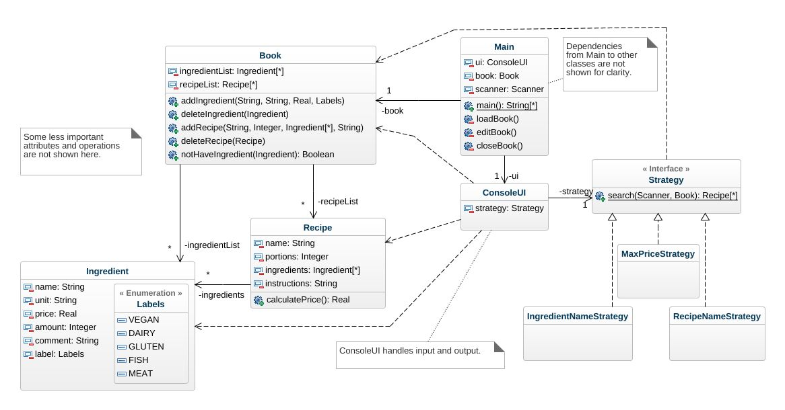

## Assignment4
Here is the final class diagram.
### Class diagram
#### Book  
This class contains two ArrayList, one for Recipe objects and another for Ingredient objects.
#### Recipe  
This class contains some attributes about a recipe(name, portions, instructions...) and an ArrayList of type Ingredient as well. It has a calculatePrice() method which calculates the total price for a recipe.
#### Ingredient  
This class contains attributes about an ingredient(name, unit, price, amount, comment, label) and two contructors which take different parameters.
 - Ingredient(String name, String unit, double price, Labels label)  
 this create Ingredient object for available ingredient list in the book
 - Ingredient(String name, String unit, double price, int amount, String comment)  
 this create specialized Ingredient object with for the recipe  

Besides, this class also contains an enum Labels which has values including VEGAN, DAIRY, GLUTEN, FISH, MEAT.
#### Main  
This is the main class. The program starts from here.
#### ConsoleUI  
This class handles user input/output.
#### Strategy  
This is an interface which contains one method: search()  
The user can search for recipes based on different strategies  
#### IngredientNameStrategy  
This class implements Strategy.  
The user can search for recipes based on ingredient names.  
#### MaxPriceStrategy  
This class implements Strategy.  
The user can search for recipes based on a max price.  
#### RecipeNameStrategy  
This class implements Strategy as well.  
The user can search for recipes based on their names.

