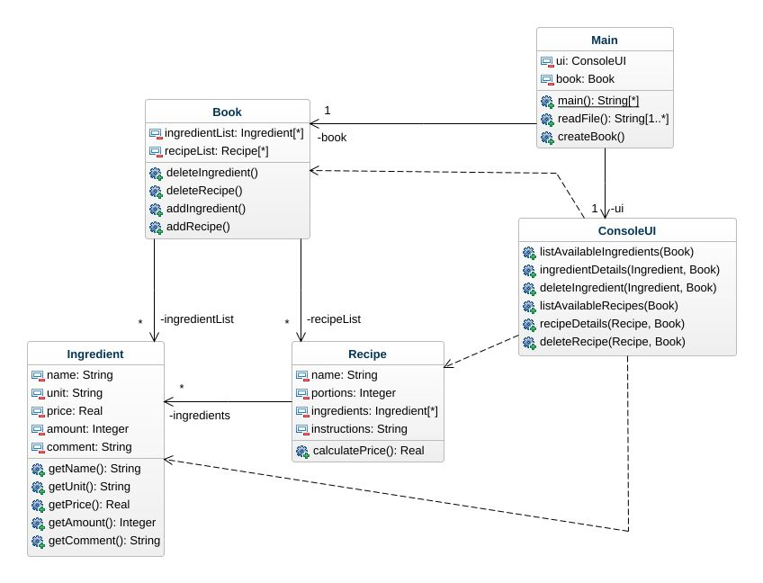

## Assignment4
Here is the initial class diagram.
### Class diagram
* Book  
This class contains two ArrayList, one for Recipe objects and another for Ingredient objects.
* Recipe  
This class contains some attributes about a recipe(name, portions, instructions...) and an ArrayList of type Ingredient as well. For now, it only has a calculatePrice() method which calculates the total price for a recipe.
* Ingredient  
This class contains attributes about an ingredient(name, unit, price, amount, comment) and some getters&setters
* Main  
This is the main class. The program starts from here.
* ConsoleUI  
This class handles user input/output.

